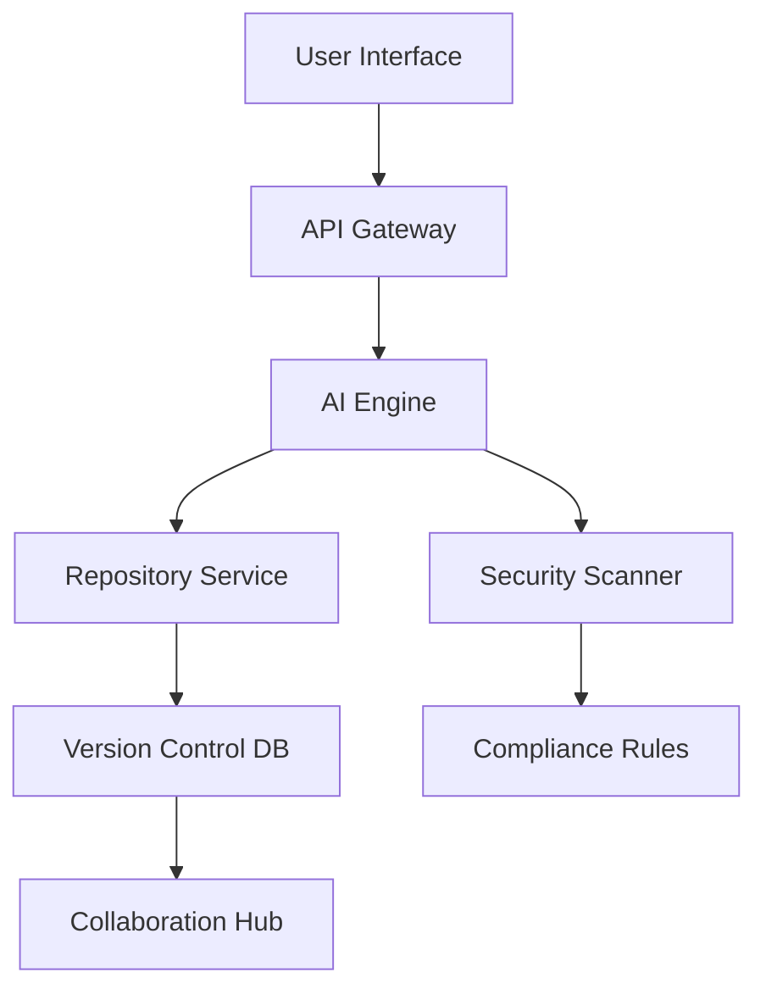

## Overview

Kohhee Peace powers your development with AI at its core. You build, collaborate, and deploy secure software using intelligent features that automate workflows, detect vulnerabilities, and scale effortlessly. This architecture integrates AI across repositories, branching, security, scalability, and collaboration.

Key benefits include AI-assisted code reviews, automated branching strategies, compliance-ready security scans, infinite scalability for enterprise projects, and real-time collaboration tools.

<Columns cols={3}>
  <Card title="AI Workflows" icon="zap" href="#ai-integration">
    Accelerate development with intelligent automation.
  </Card>
  <Card title="Branching Model" icon="git-branch" href="#branching-model">
    Streamlined version control for teams.
  </Card>
  <Card title="Security Features" icon="shield" href="#security">
    Built-in compliance and protection.
  </Card>
  <Card title="Scalability" icon="trending-up" href="#scalability">
    Handle projects of any size.
  </Card>
  <Card title="Collaboration" icon="users" href="#collaboration">
    Seamless team workflows.
  </Card>
</Columns>

## Architecture Overview

Kohhee Peace uses a layered architecture: AI Engine at the core processes code, workflows, and security data. Repositories sync with a distributed version control system, backed by scalable cloud storage.



This design ensures low-latency AI insights during your coding sessions.

## AI Integration in Workflows

You integrate AI directly into daily tasks. Kohhee Peace analyzes your code in real-time, suggesting optimizations and generating tests.

<Steps>
  <Step title="Commit Code" icon="git-commit">
    Push changes to trigger AI review.
  </Step>
  <Step title="Review Suggestions" icon="eye">
    Accept AI-generated fixes automatically.
  </Step>
  <Step title="Deploy" icon="rocket">
    AI validates before production.
  </Step>
</Steps>

<Callout kind="tip">
  Enable AI workflows in your repo settings to boost productivity by 40%.
</Callout>

## Repository and Branching Model

Kohhee Peace extends Git with AI-driven branching. You use feature branches that auto-merge when ready, reducing conflicts.

<CodeGroup tabs="Main Branch,Feature Branch">
  ```bash
  # Main workflow
  git checkout main
  git pull origin main
  git merge feature-branch
  git push origin main
  ```
  ```bash
  # AI-assisted feature branch
  kohhee branch create ai-review-feature
  kohhee ai review --auto-merge
  git push origin ai-review-feature
  ```
</CodeGroup>

This model supports Git Flow with AI predictions for stable releases.

## Security and Compliance Features

Protect your code with embedded scans. Kohhee Peace checks for vulnerabilities, secrets, and compliance on every commit.

<Tabs>
  <Tab title="Vulnerability Scan" icon="alert-triangle">
    Automatically detects CVEs in dependencies.
    
    | Check Type | Frequency | Action |
    |------------|-----------|--------|
    | Static Analysis | Every PR | Block merge |
    | Secret Scan | Every push | Notify + Mask |
    | Compliance Audit | Daily | Report dashboard |
  </Tab>
  <Tab title="Compliance" icon="check-circle">
    Supports SOC 2, GDPR, and HIPAA out-of-the-box.
    
    Configure via API:
    
    ````json
    {
      "compliance": {
        "standards": ["SOC2", "GDPR"],
        "autoEnforce": true
      }
    }
    ````
  </Tab>
</Tabs>

<Callout kind="alert">
  Never commit real secrets; use `YOUR_SECRET_KEY` placeholders.
</Callout>

## Scalability for Large-Scale Projects

You scale repositories to millions of lines without performance hits. Kohhee Peace shards data across regions and uses AI to optimize storage.

<Expandable title="Advanced Scaling Options" default-open="false">

- Horizontal pod autoscaling for CI/CD pipelines
- AI-predicted resource allocation
- Global CDN for artifact distribution

Example config:

````yaml
scaling:
  minReplicas: 3
  maxReplicas: 100
  aiPredict: true
````

</Expandable>

## Collaboration Tools and Version Control

Real-time editing, AI-summarized PRs, and conflict resolution empower your team. Integrate with Slack or Microsoft Teams for notifications.

Link to other pages for deeper dives:

<Columns cols={2}>
  <Card title="Quickstart" icon="play" href="/quickstart">
    Get started immediately.
  </Card>
  <Card title="Authentication" icon="lock" href="/authentication">
    Secure your access.
  </Card>
</Columns>